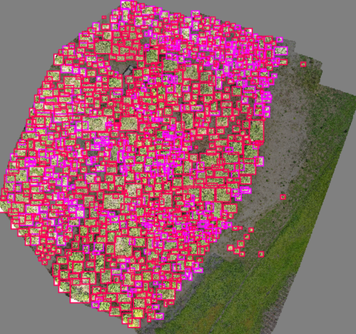

# ReforesTree-Remastered

ReforesTree is designed to be a benchmark dataset of forest carbon stock that would encourage scalable financing schemes
to protect the forests. To avoid the expensive and subjective manually labelled trees, the authors leverage the recent
advancements of AI and propose a fully automatic data processing pipeline. Furthermore, a baseline CNN is implemented to
showcase its superiority over models trained on satellite data when forecasting the carbon stock on small-scale,
tropical agroforestry sites. This project will thoroughly present their data, go through every step in the pipeline,
reproduce their experiments with the baseline CNN, and compare the expected vs actual results.

